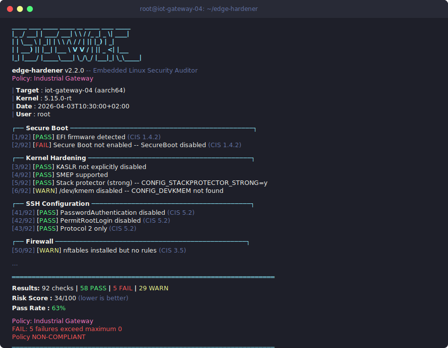

# edge-hardener



**Embedded Linux security hardening auditor for edge gateways, IoT devices, and medical/industrial systems.**

`edge-hardener` performs automated security checks on Linux-based edge devices, industrial gateways, and IoT platforms. It identifies misconfigurations, missing hardening measures, and common attack vectors specific to embedded and operational technology environments.

Designed for field engineers, DevSecOps teams, and security auditors who need a lightweight, dependency-free tool that runs directly on the target device.

## What It Checks

| Category | Checks | CIS / IEC 62443 |
|---|---|---|
| **Secure Boot** | UEFI Secure Boot status, mokutil verification | CIS 1.4.2 |
| **Kernel Hardening** | KASLR, SMEP/SMAP/NX, stack protector, FORTIFY_SOURCE, ASLR, kptr_restrict, dmesg_restrict, BPF restrictions, user namespaces | CIS 1.5, IEC 62443 CR 3.4 |
| **dm-verity** | Root filesystem integrity enforcement via dm-verity | IEC 62443 CR 3.4 |
| **Debug Interfaces** | Kernel debug params, debugfs mounts, exported GPIO pins (JTAG/SWD surface), kprobes | CIS 1.1.22 |
| **Network Exposure** | Open ports (TCP/UDP), risky services (Telnet, FTP, Modbus, MQTT, OPC UA), IP forwarding, SYN cookies, ICMP redirects, reverse path filtering | CIS 3.x, IEC 62443 CR 5 |
| **Filesystem** | World-writable files/dirs, SUID/SGID audit, /tmp mount hardening, sensitive file permissions (shadow, SSH keys, crontab) | CIS 1.1, 6.1 |
| **SSH** | PermitRootLogin, PasswordAuthentication, Protocol, MaxAuthTries, LoginGraceTime, ClientAliveInterval | CIS 5.2 |
| **Firewall** | iptables/nftables rule presence | CIS 3.5 |
| **Module Loading** | modules_disabled sysctl, module signature enforcement, blacklist rules | CIS 1.1.24 |
| **Core Dumps** | core_pattern, suid_dumpable, ulimit settings | CIS 1.5.1 |
| **Container Security** | Docker/Podman: privileged containers, capabilities, seccomp profiles, AppArmor/SELinux, socket exposure, image tagging, root user, host networking | CIS-DK 2.x, 4.x, 5.x |
| **Cryptographic Health** | OpenSSL version, weak ciphers in SSH/web configs, certificate expiration/self-signed/key size, SSH key strength, TLS protocol versions, entropy pool, hardware RNG | IEC 62443 CR 4 |
| **Supply Chain** | Binary hardening (RELRO/PIE/stack canary/NX), stripped binaries, known-vulnerable library versions, package signature verification, binary provenance, writable library paths | IEC 62443 CR 3.4 |
| **Bootloader** | GRUB password protection, GRUB file permissions, U-Boot security (bootdelay, verified boot, password, env protection), Secure Boot chain (UEFI SB, module sig, IMA), boot partition, initramfs permissions | CIS 1.4.1, IEC 62443 CR 7.5 |
| **systemd Hardening** | Service sandboxing directives (ProtectSystem, ProtectHome, NoNewPrivileges, PrivateTmp, CapabilityBoundingSet), root services without hardening, unnecessary enabled services | CIS 1.1, IEC 62443 CR 2.1 |
| **USB Device Policy** | USB authorized_default policy, USBGuard installation and configuration, removable media mount restrictions, USB mass storage kernel module status | IEC 62443 CR 1.3, CIS 1.1.24 |

## Requirements

- **Bash 4.0+** (present on all modern Linux distributions)
- **Python 3.6+** (only for HTML/text report generation)
- **Root access** recommended for full coverage (runs with reduced checks as non-root)
- No external dependencies beyond standard Linux utilities (`ss`, `mount`, `stat`, `find`, `readelf`, `openssl`)

## Usage

### Quick audit (terminal output)

```bash
sudo ./edge_hardener.sh
```

### Export JSON results

```bash
sudo ./edge_hardener.sh -j results.json
```

### JSON-only output (for CI/CD pipelines)

```bash
sudo ./edge_hardener.sh -q -j results.json
```

### Generate HTML report with executive summary

```bash
sudo ./edge_hardener.sh -j results.json
python3 generate_report.py results.json -o report.html
```

### Use a policy profile

```bash
# Industrial gateway (IEC 62443 SL-2/SL-3)
sudo ./edge_hardener.sh --policy policies/industrial-gateway.yaml

# Medical device (FDA/MDR)
sudo ./edge_hardener.sh --policy policies/medical-device.yaml -j results.json

# Embedded minimal (IoT sensors)
sudo ./edge_hardener.sh --policy policies/embedded-minimal.yaml
```

### Run specific check categories

```bash
# Only network and SSH checks
sudo ./edge_hardener.sh --checks network_exposure,ssh_hardening

# Everything except container and supply chain
sudo ./edge_hardener.sh --exclude container_audit,supply_chain_audit
```

### Auto-remediation

```bash
# Generate a fix script (review before applying)
sudo ./edge_hardener.sh --fix-script /tmp/fixes.sh

# The undo script is also generated
# /tmp/fixes-undo.sh

# Apply fixes directly (use with caution)
sudo ./edge_hardener.sh --fix
```

### Baseline comparison and trending

```bash
# First run: establish baseline
sudo ./edge_hardener.sh -j baseline.json

# Later: compare against baseline
sudo ./edge_hardener.sh -j current.json --baseline baseline.json
```

### Multiple output formats

```bash
# HTML report (default for generate_report.py)
python3 generate_report.py results.json -o report.html

# Text report
python3 generate_report.py results.json --format text -o report.txt

# Enhanced JSON with risk scores
python3 generate_report.py results.json --format json -o enhanced.json

# CSV format
sudo ./edge_hardener.sh --format csv -j results

# SARIF format (for CI/CD security scanning integration)
sudo ./edge_hardener.sh --format sarif -j results
```

### Remote audit via SSH

```bash
ssh root@gateway.local 'bash -s' < edge_hardener.sh -j /tmp/audit.json
scp root@gateway.local:/tmp/audit.json .
python3 generate_report.py audit.json -o gateway-report.html
```

## Example Output

```
    ISECWIRE
    edge-hardener v2.2.0 — Embedded Linux Security Auditor
    Policy: Industrial Gateway

    | Target : iot-gateway-04 (aarch64)
    | Kernel : 5.15.0-rt
    | Date   : 2026-04-03T10:30:00+02:00
    | User   : root

  ── Secure Boot ──────────────────────────────────────────────┐
  [1/98] [PASS] EFI firmware detected (CIS 1.4.2)
  [2/98] [PASS] Secure Boot enabled — SecureBoot enabled (CIS 1.4.2)

  ── Kernel Hardening ─────────────────────────────────────────┐
  [3/98] [PASS] KASLR not explicitly disabled
  [4/98] [PASS] SMEP supported
  [5/98] [WARN] SMAP not detected — Supervisor Mode Access Prevention unavailable
  [6/98] [PASS] Stack protector (strong) — CONFIG_STACKPROTECTOR_STRONG=y
  [7/98] [FAIL] dmesg accessible to unprivileged users — dmesg_restrict=0

  ...

  ── Cryptographic Health ─────────────────────────────────────┐
  [72/98] [PASS] OpenSSL version — OpenSSL 3.1.4 (3.x series)
  [73/98] [PASS] SSH ciphers configuration — No weak ciphers detected
  [74/98] [PASS] Entropy pool adequate — 3847 bits available

  ── Summary ──────────────────────────────────────────────────┐

    Total checks : 98
    PASS  : 78
    FAIL  : 8
    WARN  : 12

    Risk Score : 26/100 (lower is better)
    Pass Rate  : 79%

    Policy: Industrial Gateway
    FAIL: 8 failures exceed maximum 0
    Policy NON-COMPLIANT

    Action required — 8 failing check(s).
```

## Policy Profiles

Policy profiles are YAML files that control which checks run and enforce pass/fail requirements:

| Policy | Target | Standard |
|--------|--------|----------|
| `embedded-minimal.yaml` | IoT sensors, actuators | IEC 62443 SL-1 |
| `industrial-gateway.yaml` | ICS/SCADA gateways | IEC 62443 SL-2/SL-3 |
| `medical-device.yaml` | FDA/MDR medical devices | IEC 62443 SL-3, FDA Guidance |

Each policy defines:
- **Check selection**: which categories to enable/disable
- **Enforcement rules**: patterns that must pass (WARN elevated to FAIL)
- **Thresholds**: maximum failures/warnings, minimum pass percentage

Create custom policies by copying and modifying the YAML files.

## Report Features

The HTML report includes:
- **Executive summary** with risk score (0-100) and compliance rate
- **Per-category breakdown** with color-coded stacked bar chart
- **Remediation priority list** sorted by severity
- **CIS/IEC 62443 compliance percentage**
- **Baseline comparison** showing regressions, improvements, and new findings
- **Interactive filtering** (All/Failures/Warnings/Passed)

## Exit Codes

| Code | Meaning |
|------|---------|
| `0` | All checks passed |
| `1` | Warnings only (no failures) |
| `2` | One or more checks failed |
| `3` | Policy non-compliance (when `--policy` is used) |

## Project Structure

```
edge-hardener/
├── edge_hardener.sh              # Main auditor script (v2.2)
├── checks/
│   ├── kernel_audit.sh           # Kernel config and sysctl checks
│   ├── network_audit.sh          # Network exposure and protocol checks
│   ├── filesystem_audit.sh       # Filesystem permission checks
│   ├── container_audit.sh        # Docker/Podman security audit
│   ├── crypto_audit.sh           # Cryptographic health checks
│   ├── supply_chain_audit.sh     # Binary hardening and provenance
│   ├── bootloader_audit.sh       # GRUB/U-Boot security checks
│   ├── systemd_audit.sh          # systemd service hardening checks
│   └── usb_audit.sh              # USB device policy checks
├── policies/
│   ├── embedded-minimal.yaml     # IoT sensor profile (SL-1)
│   ├── industrial-gateway.yaml   # ICS/SCADA gateway profile (SL-2/3)
│   └── medical-device.yaml       # Medical device profile (SL-3/FDA)
├── generate_report.py            # Report generator (HTML/text/JSON)
├── tests/
│   ├── test_edge_hardener.sh     # Bash test suite
│   └── test_report.py            # Python test suite
├── CHANGELOG.md
├── README.md
└── LICENSE
```

## CLI Reference

```
Usage: edge_hardener.sh [OPTIONS]

Options:
  -j, --json FILE       Write JSON results to FILE
  -q, --quiet           JSON output only (no terminal colors)
  -h, --help            Show this help
  -v, --version         Show version

  --policy FILE         Load a YAML policy profile for enforcement
  --checks LIST         Run only specified check categories (comma-separated)
  --exclude LIST        Skip specified check categories (comma-separated)

  --fix                 Apply safe automatic remediations
  --fix-script FILE     Generate fix script instead of applying directly

  --baseline FILE       Compare against a previous JSON export
  --format FORMAT       Output format: text (default), json, html, csv, sarif

Check categories:
  secure_boot, kernel_hardening, dm_verity, debug_interfaces,
  network_exposure, filesystem_permissions, ssh_hardening, firewall,
  module_loading, core_dumps, container_audit, crypto_audit,
  supply_chain_audit, bootloader_audit, systemd_audit, usb_audit
```

## Integration

### CI/CD Pipeline

```yaml
# GitLab CI example
security_audit:
  stage: test
  script:
    - scp edge_hardener.sh root@${DEVICE_IP}:/tmp/
    - ssh root@${DEVICE_IP} 'bash /tmp/edge_hardener.sh -q --policy policies/industrial-gateway.yaml -j /tmp/audit.json'
    - scp root@${DEVICE_IP}:/tmp/audit.json .
    - python3 generate_report.py audit.json -o audit-report.html
  artifacts:
    paths:
      - audit-report.html
      - audit.json
  allow_failure:
    exit_codes:
      - 1  # warnings are OK
```

### GitHub Actions

```yaml
- name: Security Audit
  run: |
    sudo ./edge_hardener.sh -q --policy policies/medical-device.yaml -j results.json
  continue-on-error: true

- name: Generate Report
  run: python3 generate_report.py results.json -o report.html

- name: Upload Report
  uses: actions/upload-artifact@v4
  with:
    name: security-audit
    path: |
      results.json
      report.html
```

### Fleet-wide Auditing

Combine with Ansible, Salt, or similar tools to audit entire device fleets and aggregate JSON results into a central dashboard.

## Testing

```bash
# Run bash tests
bash tests/test_edge_hardener.sh

# Run Python tests
python3 -m pytest tests/test_report.py -v

# Syntax check all scripts
for f in edge_hardener.sh checks/*.sh; do bash -n "$f" && echo "OK: $f"; done
```

## FAQ

### What is "hardening" and why bother?

**Hardening** = locking down a system by disabling everything unnecessary and enabling all security features. Default Linux is configured for convenience ("everything works"). But a gateway in a factory doesn't need Bluetooth, USB mass storage, password-based SSH login, or 50 open network ports. Each unnecessary feature is an attack surface.

### What does edge-hardener actually check?

Over 90 checks across 12 categories. Examples:
- **Secure Boot**: is the boot chain verified? Can someone swap the kernel?
- **SSH**: does it allow password login? (should be key-only)
- **Firewall**: are there any rules? Or is everything wide open?
- **SUID binaries**: are there programs running with unnecessary root privileges?
- **Core dumps**: disabled? (they can leak sensitive data from memory)

### Why not just check manually?

Because there are 90+ things to check on every device. If you ship 100 gateways per month, that's 9000 manual checks. edge-hardener does them all in 10 seconds and gives you a compliance percentage.

### How to use it?

```bash
sudo bash edge_hardener.sh                    # colored terminal report
sudo bash edge_hardener.sh -q | jq .          # JSON for CI/CD pipeline
sudo bash edge_hardener.sh --fix              # auto-fix what's safe to fix
sudo bash edge_hardener.sh --policy policies/industrial-gateway.yaml  # check against IEC 62443 profile
```

## License

MIT License. Copyright (c) 2026 isecwire GmbH. See [LICENSE](LICENSE).
